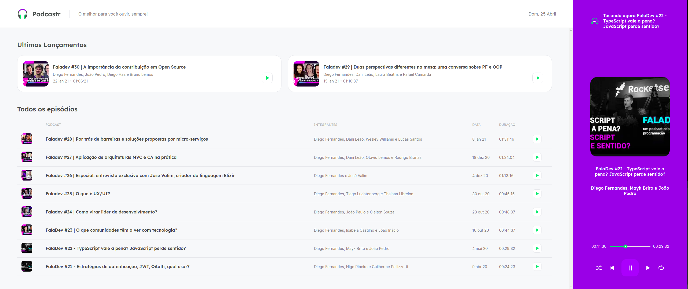
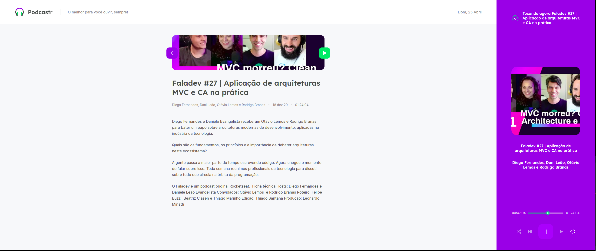

<h1 align="center" style=  >
Podcastr
</h1>

<h1>



</h1>

# Indice

- [Sobre](#-sobre)
- [Tecnologias Utilizadas](#-tecnologias-utilizadas)
- [Como baixar o projeto](#-como-baixar-o-projeto)


## ✍ Sobre

Este é o PODCASTR, uma aplicação desenvolvida na trilha de ReactJS, da 5°edição da NLW, programa realizado pela Rocketseat com intuiro de levar os programadores para o próximo nível. Foram abordados diversos assuntos, desde os fundamentos do React, como componentes, hooks, propriedades e estado, como também sobre o NextJS, onde aprendi sobre SSR(Server-side rendering) e SSG(Static site generation). Configuramos e consumimos uma API utilizando JSON-Server e o Axios.

Sobre a aplicação:

É um podcast web, que basicamente possuem duas paginas, a Home que lista os "ultimos lançamentos" e os restantes dos episódios, e a pagina do episódio em si, que possui a descrição. O componente "player" está por volta das paginas, possui todas as funcionalidades básicas de um media player tradicional. Toda lógica de embaralhar, repetir, play, pause, retornar e avançar as faixas/episódios foram aplicadas.

Está bem massa!

---

## 🔧 Tecnologias utilizadas


- [ReactJS](https://reactjs.org)
- [NextJS](https://nextjs.org/)
- [TypeScript](https://www.typescriptlang.org)
- [JSON Server](https://github.com/typicode/json-server)
- [Axios](https://github.com/axios/axios)
- [Sass](https://sass-lang.com/)

---

## ⚡ Como baixar o projeto
</br>

```bash

# Clonar o repositório
$ git clone https://github.com/lsnascimentoDev/podcast-nextJS.git

# Entrar no diretório
$ cd podcastnext

# Instalar as dependências
$ yarn install

# Iniciar o JSON-Server
$ yarn server

# Iniciar o projeto
$ yarn start
```


---

Desenvolvido por Lucas Nascimento 💪

